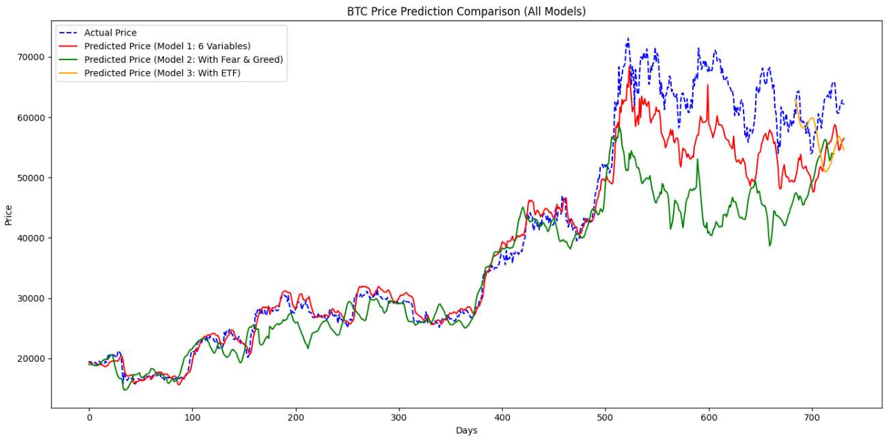
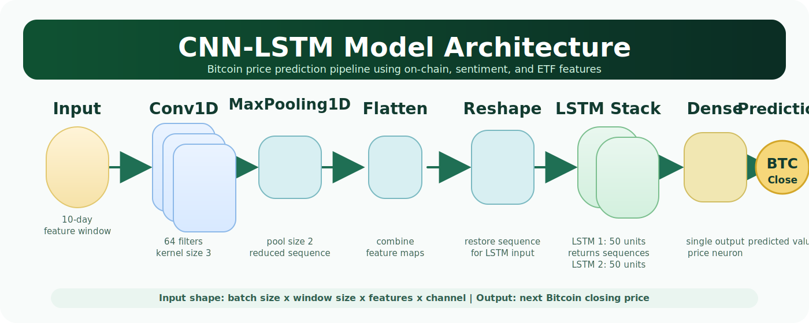

# Bitcoin Price Forecasting Using CNN-LSTM



This repository contains an explained Jupyter notebook for a Financial Data Analytics project on Bitcoin price forecasting. The project compares CNN-LSTM models using on-chain metrics, market sentiment from the Fear & Greed Index, and Bitcoin ETF inflow data.

## Project Goal

Bitcoin is highly volatile, and its price can be influenced by network activity, market sentiment, and institutional flows. This project tests whether adding sentiment and ETF data improves Bitcoin price forecasting compared with a baseline model built from on-chain metrics.

## Notebook

| File | Description |
| --- | --- |
| `BTC_Predict_CNN_LSTM.ipynb` | Main explained notebook with section headers, code, preprocessing steps, model training, and evaluation |
| `assets/btc_price_prediction_comparison.png` | Result image extracted from the project PowerPoint presentation |
| `assets/cnn_lstm_architecture.svg` | Clean CNN-LSTM architecture diagram for the README |

## Model Variants

| Model | Features Used | RMSE | MAE |
| --- | --- | ---: | ---: |
| Model 1 | On-chain metrics | 4,843.7662 | 3,187.3234 |
| Model 2 | On-chain metrics + Fear & Greed Index | 9,774.2274 | 6,408.9271 |
| Model 3 | On-chain metrics + ETF inflow | 5,701.7242 | 4,582.2892 |

## Key Findings

- The on-chain-only model produced the lowest RMSE and MAE.
- Adding the Fear & Greed Index increased prediction error in this experiment.
- ETF inflow data performed better than the sentiment model but did not outperform the on-chain baseline.
- On-chain metrics were the strongest signal for Bitcoin price forecasting in this project.

## Methodology

The notebook follows this workflow:

1. Collect Bitcoin price, on-chain, sentiment, and ETF data.
2. Clean and align datasets by date.
3. Encode sentiment labels into numeric values.
4. Create a one-day lagged Bitcoin price feature.
5. Scale features using MinMaxScaler.
6. Create 10-day sliding windows for time-series modeling.
7. Train CNN-LSTM models.
8. Evaluate results using RMSE and MAE.
9. Visualize predicted vs. actual Bitcoin prices.

## CNN-LSTM Architecture



The model combines convolutional and recurrent layers:

- `Conv1D` extracts short-term local patterns from feature windows.
- `MaxPooling1D` reduces feature complexity.
- `LSTM` layers learn temporal dependencies.
- `Dense` output layer predicts Bitcoin closing price.

## How to Use

Open the notebook:

```bash
jupyter notebook BTC_Predict_CNN_LSTM.ipynb
```

Recommended Python packages:

```bash
pip install pandas numpy scikit-learn matplotlib tensorflow keras requests yfinance
```

## Notes

The notebook was originally developed in Google Colab. Some cells may use paths such as `/content/drive/MyDrive/FDA/`. If running locally, update those paths to match the location of your data files.

## Course Information

Course: Financial Data Analytics  
Instructor: Asst. Prof. Dr. Chaiwat Nuthong

Team members:

- Kanatach Eaimrittikrai
- Tanakorn Kosawanichkarn
- Warunyoo Panjing
